<div align="center">



<br/>

<a href="https://git.io/typing-svg">
  
</a>

<br/><br/>

<a href="https://t.me/Diyorbek_Primqulov"></a>
<a href="https://linkedin.com/in/diyorbek_primqulov"></a>
<a href="https://instagram.com/Primqulov_diyorbek"></a>
<a href="https://github.com/Primqulov?tab=followers"></a>

<br/><br/>


## Men haqimda

</div>

```dart
class DiyorbekPrimqulov extends FlutterDeveloper {
  final String name     = "Diyorbek Primqulov";
  final String role     = "Flutter Developer · Mobile App Engineer";
  final String location = "Toshkent, O'zbekiston 🇺🇿";

  final List<String> currentProjects = [
    "YouTube Clone  — Flutter + Firebase",
    "Ishchibormi    — O'zbekiston online bozori platformasi",
  ];

  final Map<String, List<String>> skills = {
    "mobile"   : ["Flutter & Dart", "BLoC / Provider", "Clean Architecture"],
    "backend"  : ["Firebase", "REST API"],
    "workflow" : ["Git & GitHub", "UI/UX Design", "Agile / Scrum"],
  };

  String get funFact => "Men code yozganda choyim sovib qoladi ☕";
}
```

<div align="center">


## Ko'nikmalar



<br/><br/>

<sub><b>VOSITALAR</b></sub>

<br/><br/>


<br/><br/>


## Asosiy loyihalar

<a href="https://github.com/Primqulov?tab=repositories"></a>
<a href="https://github.com/Primqulov?tab=repositories"></a>

<br/><br/>


## GitHub statistikasi


<br/><br/>


<br/><br/>

<picture>
  <source media="(prefers-color-scheme: dark)" srcset="https://raw.githubusercontent.com/Primqulov/Primqulov/output/github-contribution-grid-snake-dark.svg" />
  <source media="(prefers-color-scheme: light)" srcset="https://raw.githubusercontent.com/Primqulov/Primqulov/output/github-contribution-grid-snake.svg" />
  
</picture>

<br/><br/>


<br/><br/>


<sub>Oxirgi yangilanish: <!--UPDATED-->26.09.2026<!--/UPDATED--></sub>

</div>
